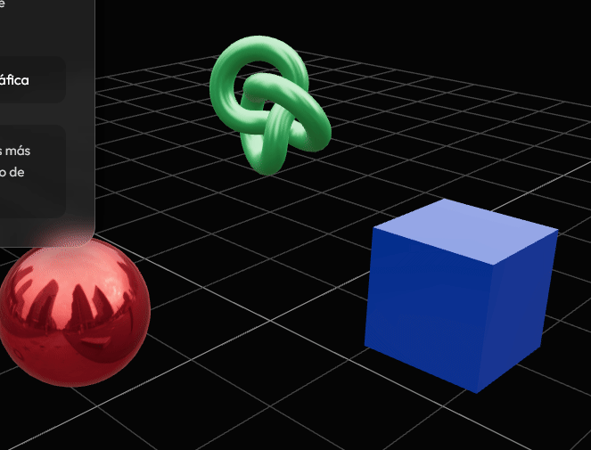
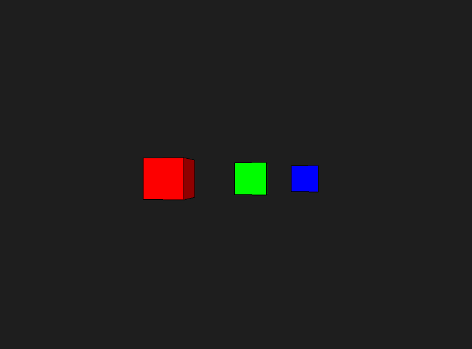
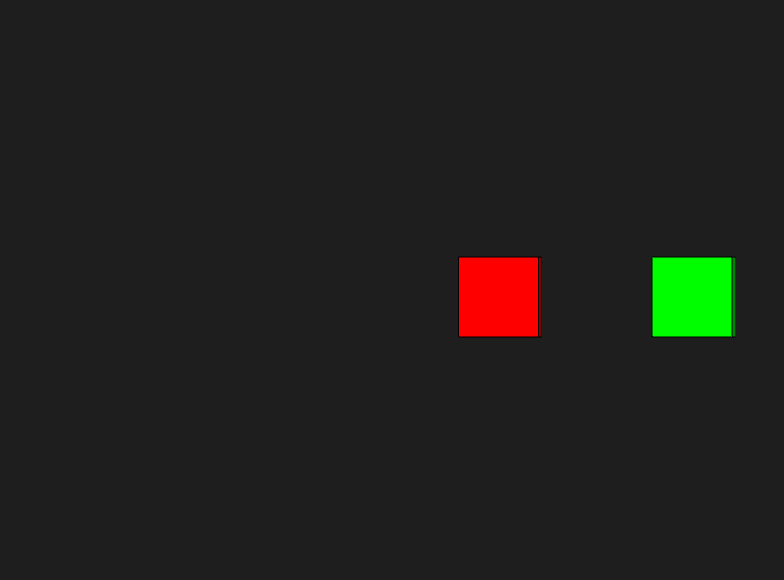

# Taller Espacios Proyectivos Matrices Proyeccion

Victor Saa y

## Fecha de entrega

`2026-02-27`

## Descripción

Este proyecto es una aplicación para evaluar perspectivas y proyecciones.

## Implementaciónes

### Python

Se utilizó jupyter notebook para la implementación. Se carga el objeto y se extrae la geometría, vertices y caras. Se utiliza matplotlib para la visualización.

```bash
# Crear el entorno virtual
python -m venv .venv

# Activar el entorno virtual
.venv\Scripts\activate

# Instalar dependencias
pip install -r requirements.txt
```

### Jupyter en el editor (VS Code, Antigravity, etc.)

```bash
# Registrar el kernel para Jupyter
python -m ipykernel install --user --name semana2-1-visual --display-name "Python (semana2-1-visual)"
```

Abre `main.ipynb`, haz clic en el selector de kernel (arriba a la derecha) y elige **Python (semana2-1-visual)**.

### Three.js

Se utilizó three.js para la implementación. Se carga el objeto y se extrae la geometría, vertices y caras. Se utiliza three fiber para la visualización.

```bash
cd threejs

# Con yarn
yarn install
yarn dev

# Con npm
npm install
npm run dev
```

### Processing

Se utilizó processing para implementar la diferencia en la visualización entre el modo perspectiva y el modo ortográfico.

```java
void draw() {
  background(30);
  
  if (usarPerspectiva) {
    float fov = PI/3.0;
    float aspect = float(width)/float(height);
    perspective(fov, aspect, 1, 1000);
  } else {
    ortho(-width/2, width/2, -height/2, height/2, 1, 1000);
  }

  lights();
  
  translate(width/2, height/2);
  rotateY(angulo);
  angulo += 0.01;

  // Cubo cercano
  pushMatrix();
  translate(-150, 0, -100);
  fill(255, 0, 0);
  box(80);
  popMatrix();

  // Cubo medio
  pushMatrix();
  translate(0, 0, -300);
  fill(0, 255, 0);
  box(80);
  popMatrix();

  // Cubo lejano
  pushMatrix();
  translate(150, 0, -500);
  fill(0, 0, 255);
  box(80);
  popMatrix();
}
```

## IA

IDE, prompts y autocompletado: Antigravity

## Resultados visuales







## Prompts utilizados

Se usaron prompts para generar objetos en threejs.

## Aprendizajes

Aca se jugo con la implementacion de distintas perspectivas.

## Contribuciones grupales (si aplica)

(Contribuciones)

---

## Estructura del proyecto

```
semana_2_1_espacios_proyectivos_matrices_proyeccion/
    ├── python/
    ├── processing/
    ├── threejs/
    ├── media/
    └── README.md
```

---

## Referencias

Lista las fuentes, tutoriales, documentación o papers consultados durante el desarrollo:

- Documentación oficial de NumPy: https://numpy.org/doc/
- Tutorial de React Three Fiber: https://docs.pmnd.rs/react-three-fiber/
- Documentación oficial de Processing: https://processing.org/reference/

