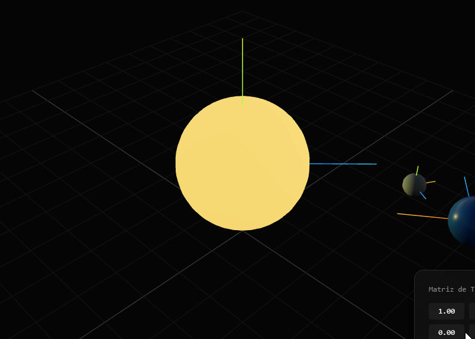

# Taller Transformaciones

Victor Saa y

Fecha de entrega: 27/02/2026

## Descripción

Este proyecto es una aplicación para emular un sistema solar con transformaciones homogeneas y grupos jerarquicos.

## Implementaciónes

### Python

Se utilizó jupyter notebook para la implementación. Se carga el objeto y se extrae la geometría, vertices y caras. Se utiliza matplotlib para la visualización.

```bash
# Crear el entorno virtual
python -m venv .venv

# Activar el entorno virtual
.venv\Scripts\activate

# Instalar dependencias
pip install -r requirements.txt
```

### Jupyter en el editor (VS Code, Antigravity, etc.)

```bash
# Registrar el kernel para Jupyter
python -m ipykernel install --user --name semana4-visual --display-name "Python (semana4-visual)"
```

Abre `main.ipynb`, haz clic en el selector de kernel (arriba a la derecha) y elige **Python (semana4-visual)**.

### Three.js

Se utilizó three.js para la implementación. Se carga el objeto y se extrae la geometría, vertices y caras. Se utiliza three fiber para la visualización.

```bash
cd threejs

# Con yarn
yarn install
yarn dev

# Con npm
npm install
npm run dev
```

## IA

IDE, prompts y autocompletado: Antigravity

## Resultados visuales




## Prompts utilizados

Aca me ayude de Antigravity construir la escena base del sistema solar.

## Aprendizajes

Los grupos jerarquicos son muy utiles para transmitir transformaciones a sus hijos sin complicarse.
